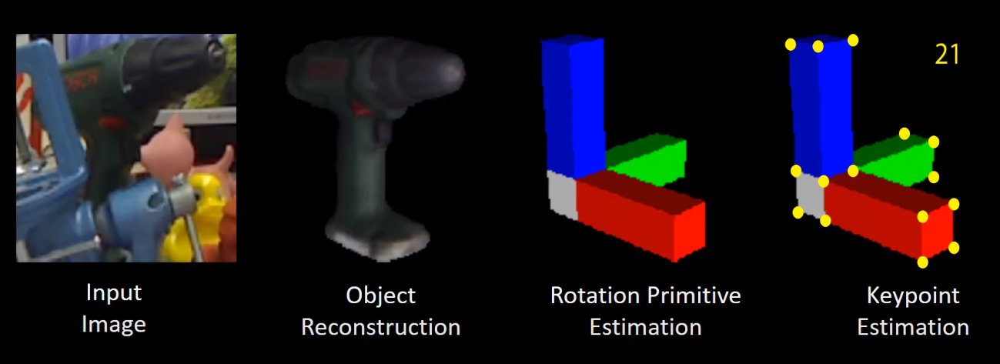

<h1 align="center">
  ** Source code will be available soon after review process **
</h1>

# PrimA6D

<div align="left">  
  <a href="https://scholar.google.co.kr/citations?user=ivOqySYAAAAJ">Myung-Hwan Jeon</a>,  
  Jeongyun Kim,
  <a href="https://ayoungk.github.io/">Ayoung Kim</a>  
  at <a href="https://rpm.snu.ac.kr">Robust Perception for Mobile Robotics Laboratory (RPM Robotics Lab)</a>
</div>

## Note
- Our study named PrimA6D is accepted for RA-L.
  - [Paper](https://arxiv.org/abs/2006.07789), [Video](https://youtu.be/HbNmsmTLRmk)
- The extended version, PrimA6D++, is under review.
  - [Paper](), [Video](https://youtu.be/akbI61jUJgY)

## What is PrimA6D?
 - ***PrimA6D (RA-L 2022)***
    - PrimA6D reconstructs the rotation primitive and its associated keypoints corresponding to the target object for enhancing the orientation inference.
    <div align="center">
      <a href="https://www.youtube.com/watch?v=HbNmsmTLRmk"></a>
    </div>
    
    - More details in [PrimA6D: Rotational Primitive Reconstruction for Enhanced and Robust 6D Pose Estimation](https://arxiv.org/abs/2006.07789)

 - ***PrimA6D++ (Under Review)***
   - PrimA6D++ estimates three rotation axis primitive images and their associated uncertainties.    
    <div align="center">
      <a href="https://www.youtube.com/watch?v=HbNmsmTLRmk"></a>
      <a href="https://www.youtube.com/watch?v=HbNmsmTLRmk"></a>
    </div>
   - With estimated uncertainties, PrimA6D++ handles object ambiguity without prior information on object shape.
    <div align="center">
      <a href="https://www.youtube.com/watch?v=HbNmsmTLRmk"></a>
      <a href="https://www.youtube.com/watch?v=HbNmsmTLRmk"></a>
    </div>
    
   - More details in [Ambiguity-Aware Multi-Object Pose Optimization for Visually-Assisted Robot Manipulation]()

 - ***Object-SLAM for Multi-Object Pose Optimization (Under Review)***
   - Leveraging the uncertainty, we formulate the problem as an object-SLAM to optimize multi-object poses.
   - More details in [Ambiguity-Aware Multi-Object Pose Optimization for Visually-Assisted Robot Manipulation]()

  
## How to use
 1. 
 2. 
 3. 

## Citation

Please consider citing the paper as:
```
@ARTICLE{9123683,
author={Jeon, Myung-Hwan and Kim, Ayoung},
journal={IEEE Robotics and Automation Letters}, 
title={PrimA6D: Rotational Primitive Reconstruction for Enhanced and Robust 6D Pose Estimation}, 
year={2020},
volume={5},
number={3},
pages={4955-4962},
doi={10.1109/LRA.2020.3004322}}

@ARTICLE{mjeon_prima6d,
title={Ambiguity-Aware Multi-Object Pose Optimization for Visually-Assisted Robot Manipulation},
author={Myung-Hwan Jeon and Jeongyun Kim and Ayoung Kim},
journal={Under Review}}
```

## Contact
If you have any questions, contact here please
```
myunghwan.jeon@kaist.ac.kr
```
